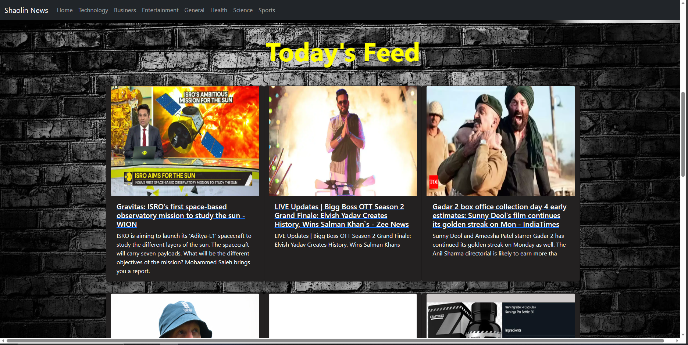
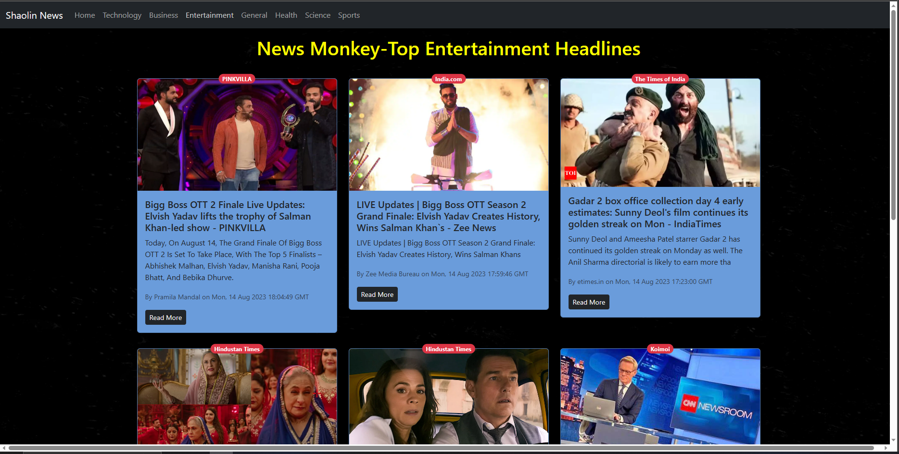

# NewsMonkey
The website provides news using an api,the news links can be used to navigate the user to the main page of the news.The news is categorised in various categories like General,Technology,etc.The News provides a total of 8 news headlines in a page.

## Tech Stack
### `ReactJ`  `NodeJS` 

## Snaps:

